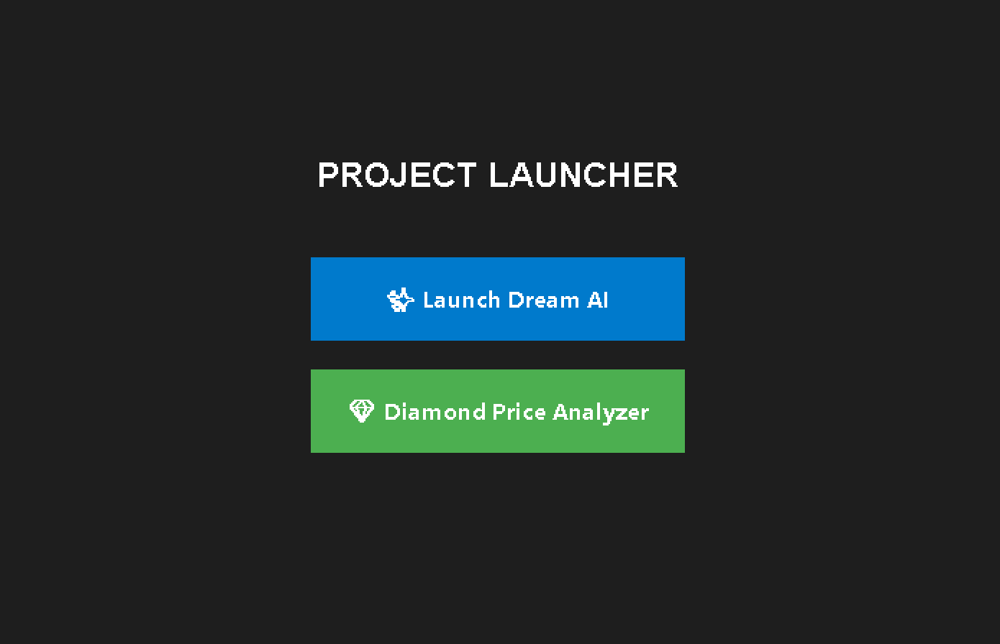
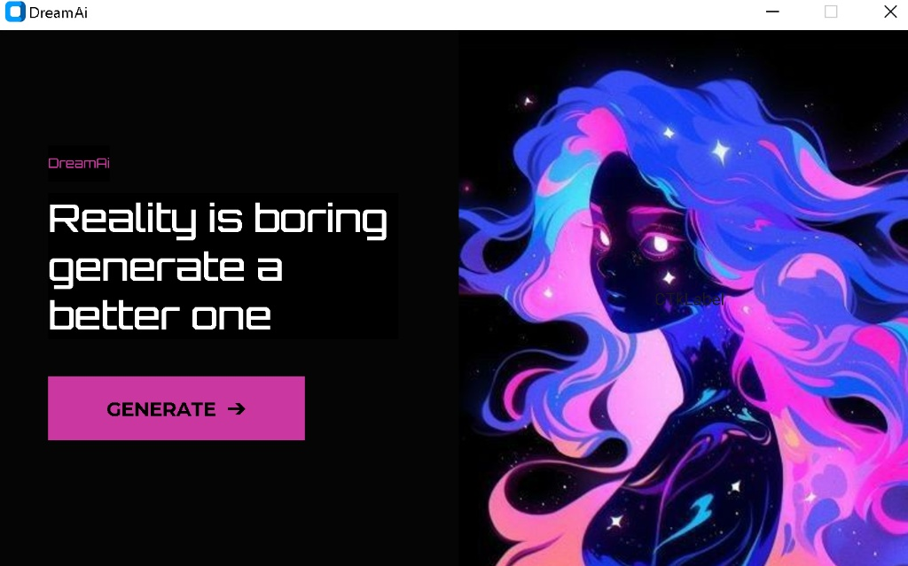
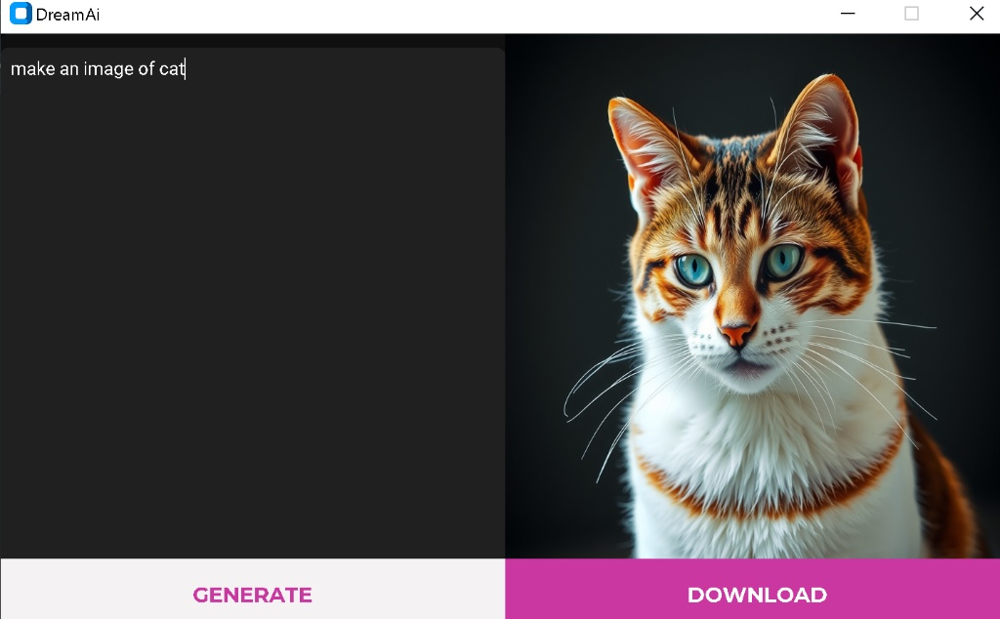
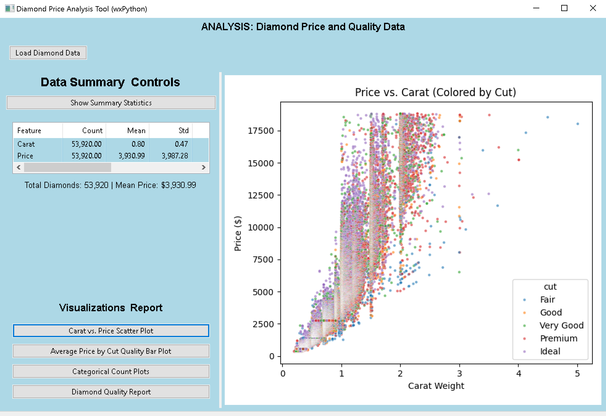
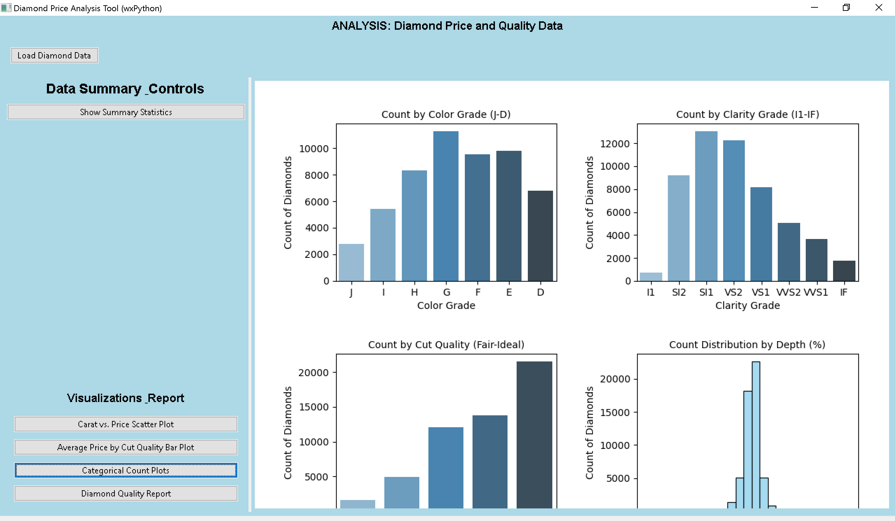
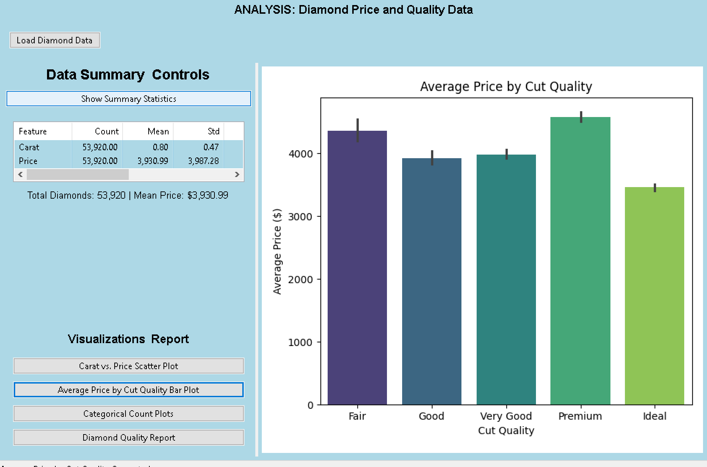

# Python Jackfruit Project Collection 🐍

A comprehensive Python project collection featuring an AI image generator and a data analysis tool, all managed by a unified graphical launcher.

## 📂 Projects Included

### 1. DreamAi ✨
An interactive AI-powered image generation tool.
* **Features:** Modern dark UI, connects to image APIs to generate high-quality art from text prompts.
* **Tech Stack:** Python, Custom Tkinter GUI, API integration.
* **Location:** `/DreamAi`

### 2. Diamond Price Analyzer 💎
A data science tool for visualizing and analyzing diamond market data.
* **Features:** Interactive scatter plots with categorical coloring, bar charts for average pricing, and detailed data summaries.
* **Tech Stack:** Python, Pandas, Matplotlib/Seaborn, Tkinter.
* **Location:** `/DimonPriceAnalyzer`

---

## 📸 Project Gallery

### 🚀 Main Interface & Workflow
| **Project Launcher** | |
| :---: | :---: |
|  |  |

### ✨ DreamAi Application
| **DreamAi Landing Interface** | **Image Generation Result** |
| :---: | :---: |
|  |  |

### 💎 Diamond Price Analyzer
| **Data Summary Dashboard** | **Interactive Scatter Plot** |
| :---: | :---: |
|  |  |

| **Categorical Bar Plot** | |
| :---: | :---: |
|  | *Visualizing average price distribution by cut quality.* |

---

## 🚀 Getting Started

### Prerequisites
Ensure you have Python installed along with the required libraries for both projects:

```bash
pip install pandas requests pillow matplotlib seaborn tkinter customtkinter
